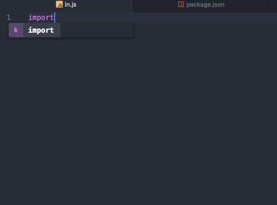

# import-cost package

Lets you know how heavy your imports are!
like VSCodes [import-cost](https://marketplace.visualstudio.com/items?itemName=wix.vscode-import-cost)

### Walkthrough
At this point it hits API provided by [bundlephobia](http://bundlephobia.com/) to determine the module size based on the version listed in your `package.json`.

If the module hasn't been installed / not present in `package.json`, it assumes the latest version of the module.
import-cost is triggered when active panel is switched / saved and displaying the size right beside the statement.


### Demo


### Installation

```
apm install import-cost
```
